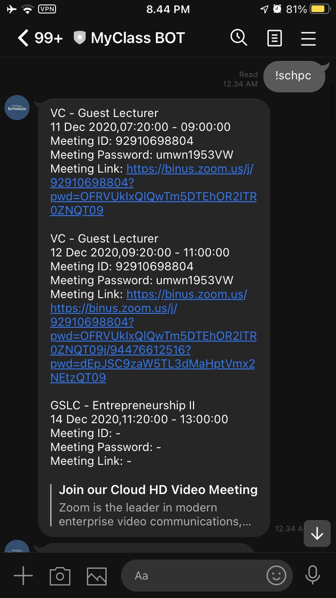

# MyClass LINE Bot

A Bot for loading and accessing class from the website MyClass withing the LINE Messenger App. Created using Python with Flask.

## Installation

-   Pull code from repo
    ```
    git pull https://github.com/KevinYobeth/Flask-LINEMyClass
    ```
-   Install required dependencies
    ```
    pip install -r requirements.txt
    ```
-   Create `.env` file, with your `CHANNEL_ACCESS_TOKEN` and `CHANNEL_SECRET` as key
-   Run python server
    ```
    python3 main.py
    ```

## Deployment
You can read more about this bot deployment from [here](https://developers.line.biz/en/docs/messaging-api/building-bot/). This repo is configured for deployment to heroku.

## App Preview
### List 5 Upcoming Class
 

**Disclaimer:** This bot is created for educational & convenient purposes only.
